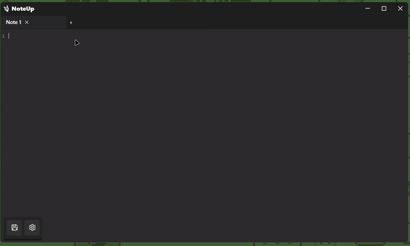

# NoteUp 📝
**NoteUp:** Your free, no fluff alternative to Notepad.

## Guide 💡 

| Icon | Description                                   |
| :--: | :-------------------------------------------- |
| ➡️    | **Coming Soon:** Will come in upcoming versions of NoteUp.       |
| ❌    | **Not Planned:** This feature is currently not planned for official releases.          |
| ✅    | **Planned:** Is being added to the next release of NoteUp         |

### Features 🪶

- **Lightweight**: Uses barely any ram, while 0% of the CPU with a few tabs, check Task Manager screenshot in the [showcase!](#showcase).

- **Completely Free & AI-Free:** No hidden costs, no pay-to-win features, and absolutely no AI messing with your notes. Just a pure, focused text editor.

### Customizability Options 🎨

We know you like things your way, so NoteUp lets you switch it up:

- **Tab Editing**: You can rename and add emojis to your tab! ( Will not apply to file names )

- **Mica**: Has Mica support! (Windows 11 only) (➡️)

- **Mini Notes**: Take notes in a hot minute! (➡️)

- **UI Customization:** Personalize your interface by adding or removing elements through the ***Settings*** menu.

- **Advanced Theming:** Personalize NoteUp with background titlebar images, and fonts! Get ready to make it truly yours. (✅)

#### (More customization options coming soon!)

## Showcase 🎩

_**Disclaimer:** All features and plans outlined above are subject to change based on development and user feedback._

