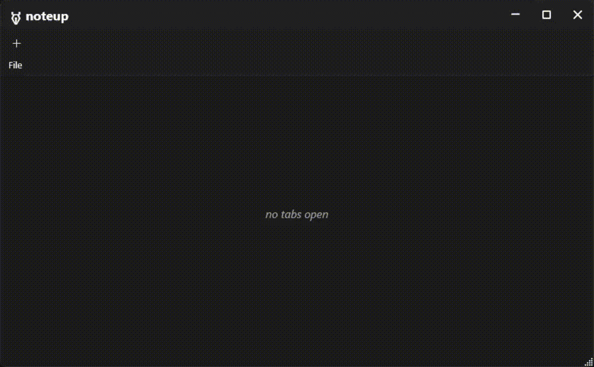

# DISCONTINUED! ⚠️
NoteUp was only a test to see what i can make with WinUi3 and WPF, plus it was horribly optimized and there are much better notepad apps out there!!

The reason i made a full app just for testing, to test the waters! NoteUp will be preserved but never updated unless i find a good reason.

thanks!

-yp

______________

learn more on my Discord: https://discord.gg/KmdKfcEKWa

______________
 
## NoteUp 📝
**NoteUp:** Your free, no fluff alternative to Notepad.

### Features 🪶

- **Lightweight**: Uses barely any ram, while 0% of the CPU with a few tabs    

- **Completely Free & AI-Free:** No hidden costs, no pay-to-win features, and absolutely no AI messing with your notes. Just a pure, focused text editor.

Showcase 📸
-

-
_**Disclaimer:** All features and plans outlined above are subject to change based on development and user feedback._

